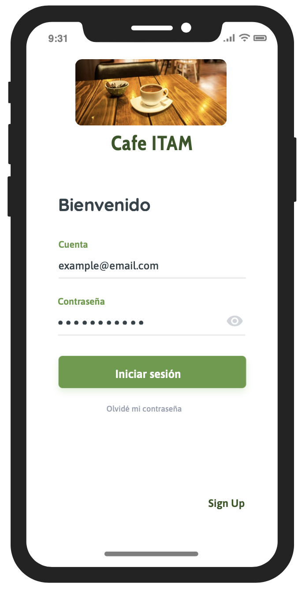

### Prototipo y pruebas de usabilidad para CAFEITAM 
## Prototipo
El prototipo interactivo fue desarrollado en moqups.com y lo puedes encontrar [aquí](https://app.moqups.com/xBNOLsfVMgjtg0WaLxAWVlUUXMwVZqmV/view/page/a28c22c2e)

### Iniciar Sesión
Pantalla principal para inicio de sesión.
Componentes:
- Cuadro de texto donde el estudiante escribe su correo asociado a la cuenta.
- Cuadro de texto donde el estudiante escribe su contraseña de la cuenta.
- Botón de inicio de sesión para validar los datos de la cuenta.

### Menú
Pantalla de menú para seleccionar platillos y agregarlos al carrito de compra.
Componentes:
- Barra de búsqueda donde el estudiante consulta un platillo.
- Botones "+" en cada platillo para escoger dicho platillo y agregarlo al carrito de compras.
- Etiqueta que lleva la cuenta de platillos que seleccionó el estudiante.
- Botón del carrito de compras para redirigir al estudiante al pago.

### Pago
Pantalla de pago para seleccionar tipo de pago y completar pedido.
Componentes:
- Botónes para escoger la forma de pago.
- Botón para pagar y completar la orden.

### Validación de pedido
Pantalla de validación de pago para completar la orden.
Componentes:
- Código QR para validar el pedido al mostrar en la cafetería.

## Prueba de usabilidad
La prueba de usabilidad se desarrollaron en la herramienta usabilityhub.com. Para realizar la prueba entrar a: https://app.usabilityhub.com/do/86992da6abba/c760

Objetivo: El estudiante completa un pedido en 5 clics o menos.

¿El estudiante sabrá en qué botones hacer clic si no se le indica específicamente? 

Características del sujeto: estudiante del ITAM que quiere desayunar en la cafetería y hacer su pedido desde la aplicación móvil CAFEITAM.

Lista de tareas:
1. Iniciar sesión
2. Escoger unos chilaquiles verdes con pollo
3. Pagar con efectivo

Para realizar la prueba se pidió a 20 estudiantes aleatorios ingresar al link de la prueba y seguir las instrucciones. El rol del moderador fue explicar el objetivo de la prueba y observar al estudiante completar la lista de tareas.

En la prueba se evaluaron las métricas:
- Porcentaje de estudiantes que realizan el pedido en 5 clics o menos.
- Porcentaje de estudiantes que seleccionan el botón correcto por tarea.
- Tiempo promedio para realizar cada tarea.
- Mapa de calor para cada botón de prueba.

### Resultados
Los resultados actualizados de la prueba se pueden encontrar en: https://app.usabilityhub.com/tests/86992da6abba/results/432157efb743

#### 100% de los estudiantes que realizaron la prueba completaron su pedido en 5 clics o menos

#### Porcentaje de estudiantes que acertaron en las tareas y tiempo promedio:

#### Mapa de calor para cada tarea:

